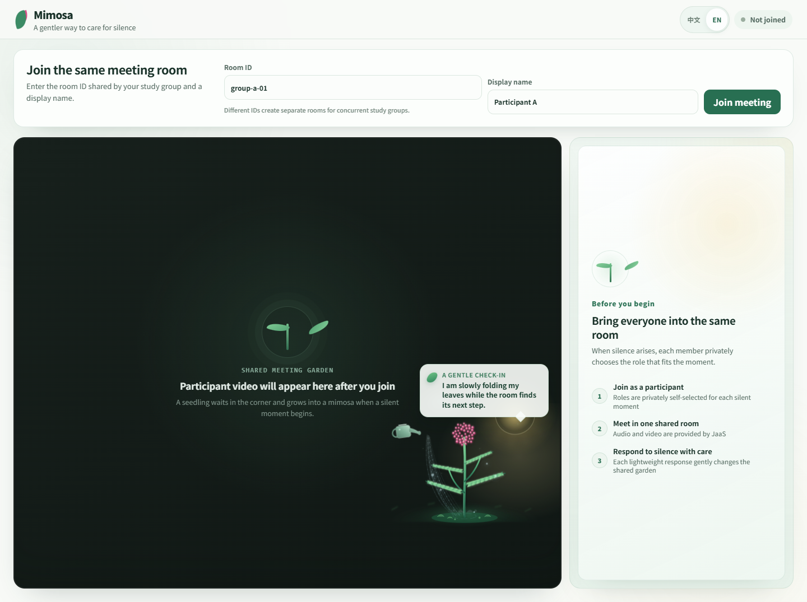

# Mimosa

[English](README.md) | [简体中文](README.zh-CN.md)

Mimosa is a bilingual, browser-based companion for online meetings. It gives a group a calm, playful way to handle an unanswered question without identifying, scoring, or publicly singling out a participant.

The application embeds a Jitsi/JaaS meeting and adds a shared ecological scene. Participants can privately express that they need time, are checking something, or feel some social pressure. These private choices are translated into anonymous sunlight, watering, and cloud cues. The person waiting for an answer can then slow down, open the question to the room, rephrase it, or save it for later.

**Live site:** [mimosa-srtp.com](https://mimosa-srtp.com)<br>
**License:** [MIT](LICENSE)



## What it offers

- A complete browser meeting experience powered by Jitsi as a Service (JaaS).
- Chinese and English interfaces that can be changed before or during a call.
- Manual open-question marking and optional local silence sensing.
- Jitsi's familiar silence-reaction cricket cue when somebody claims the waiting role, paired with the visual prompt for members whose attention is outside the meeting window.
- Private, low-effort responses with anonymous shared feedback.
- A living mimosa scene with growth, leaf movement, sunlight, watering, clouds, seed storage, and restoration animations.
- Editable deferred questions that can be brought back into the conversation.
- A draggable overlay whose position is remembered in the current browser.
- Dynamic room membership; the interaction is not limited to four participants.
- No account system and no server-side speech transcription in this repository.

## How a Mimosa round works

1. A member marks a question as open. Alternatively, after somebody has spoken, the local speech-activity logic can notice a sustained quiet period.
2. Each member privately chooses the position that best fits the moment. A member may claim that they are waiting for a response, may be likely to respond, or may dismiss Mimosa for this moment.
3. Once somebody claims the waiting role, a seedling grows into a mimosa and its leaves begin to close gradually.
4. Other members can privately choose **Need a little time**, **Checking something**, or **Feeling some pressure**.
5. Their identities remain private. The shared scene expresses the room's responses through coordinated environmental cues, while the waiting member can see anonymous totals.
6. The waiting member responds with a supportive action: allow more time, invite the whole room, rephrase the question, return later, or confirm that somebody has responded.
7. A deferred question becomes a seed. It can be edited and reopened later.

The ecological scene is deliberately an action cue rather than a diagnosis. Mimosa does not claim that it knows why a person is silent.

## Simple reminder condition

The same deployment also includes a deliberately minimal comparison condition. Add `condition=baseline` to the URL to use it.

1. At least one utterance occurs in the room.
2. When the conversation then remains quiet for 8 seconds, the room receives the same cricket cue used by Mimosa.
3. A non-interactive reminder appears for 5 seconds: “The conversation has gone quiet for a moment. Take your time, or decide together how to move forward.”
4. The reminder fades early if speech resumes.
5. It does not repeat during the same uninterrupted silence. A new utterance re-arms the detector.

This condition contains no plant, role selection, private response, ecological feedback, care action, or seed bank. Both conditions use the same meeting, silence threshold, sound, language options, room membership, and pseudonymous event logging.

## Use the hosted version

Open [https://mimosa-srtp.com](https://mimosa-srtp.com), enter a room name and display name, and join. People who enter the same room name meet one another; different room names create independent meetings.

You can also prepare links in advance:

```text
Mimosa, Chinese: https://mimosa-srtp.com/?condition=mimosa&room=community-weekly&name=Alex
Mimosa, English: https://mimosa-srtp.com/?condition=mimosa&room=community-weekly&name=Alex&lang=en
Simple reminder, Chinese: https://mimosa-srtp.com/?condition=baseline&room=community-weekly&name=Alex
Simple reminder, English: https://mimosa-srtp.com/?condition=baseline&room=community-weekly&name=Alex&lang=en
```

Use a unique room name for every simultaneous group. Room names should contain only simple letters, numbers, and hyphens, for example `team-a-2026-07-31`.

## Run locally

### Requirements

- A current Node.js LTS release (Node.js 22 is recommended).
- npm, included with Node.js.
- A modern Chromium, Firefox, or Safari browser with camera and microphone permission.

### Install

```bash
git clone https://github.com/123Cx330Yrx/Mimosa.git
cd Mimosa
npm install
cp .env.example .env.local
npm run dev
```

On Windows PowerShell, replace the `cp` command with:

```powershell
Copy-Item .env.example .env.local
```

Open the local address printed by Vite, normally `http://localhost:5173`.

## Configure Jitsi as a Service

Mimosa uses JaaS for the embedded audio/video room. For a public deployment, create your own JaaS application in the 8x8 developer console and copy its App ID into `.env.local`:

```dotenv
VITE_JAAS_APP_ID=vpaas-magic-cookie-your-app-id
VITE_RESPONSE_COUNT_MODE=exact
```

`VITE_JAAS_APP_ID` is a public project identifier and is expected to be included in the built JavaScript. It is not a private key.

Never place a JaaS private key, API secret, or long-lived JWT in `.env.local` or any `VITE_*` variable: Vite exposes these values to the browser. If your deployment requires authenticated users, recording, or other protected JaaS features, add a server-side token endpoint and issue short-lived JWTs there.

### Configuration options

| Variable | Values | Purpose |
| --- | --- | --- |
| `VITE_JAAS_APP_ID` | JaaS App ID | Selects the JaaS application used by the embedded meeting. |
| `VITE_RESPONSE_COUNT_MODE` | `exact`, `coarse`, `hidden` | Controls how anonymous response totals are shown to the waiting member. |

Restart the development server after changing environment variables.

## Everyday use

### Create or join a room

Enter the same room name on each device. Mimosa does not impose a four-person limit, although the practical room size is also governed by your JaaS plan and the participants' devices and network conditions.

### Change language

Use the language control in the interface or add `lang=en` to the URL. Without that parameter, Mimosa starts in Chinese.

### Change condition

Use `condition=mimosa` for the complete Mimosa interaction and `condition=baseline` for the simple reminder. Without a `condition` parameter, the application opens Mimosa.

The two conditions have separate top-level applications. `App.tsx` only selects `MimosaApp` or `BaselineApp`; baseline timers and reminder state are not mounted on the Mimosa route. Maintainers can run `npm run verify:mimosa` to confirm that the Mimosa implementation has not drifted from the last pre-baseline release, apart from the explicitly approved lower notification volume.

Participant and non-participating observer links for one baseline room are:

```text
Participant: https://mimosa-srtp.com/?condition=baseline&room=group-a&name=Participant-A
Observer: https://mimosa-srtp.com/?condition=baseline&room=group-a&name=Researcher&research=1
```

Every member of one session, including its observer, must use the same `condition` and `room` values. Mimosa maps the condition to a separate underlying Jitsi room, so `group-a` in the baseline does not mix audio, video, or study messages with `group-a` in Mimosa. The observer is excluded from silence sensing and participant interaction, but can mark the session and collect the condition-labelled event logs.

### Move the plant

Drag the dialogue bubble to move the entire Mimosa overlay. The position is saved in the browser. Double-click the drag area to restore the default position.

### Run several meetings at once

Give every group a distinct `room` value:

```text
https://mimosa-srtp.com/?room=book-club-a
https://mimosa-srtp.com/?room=book-club-b
https://mimosa-srtp.com/?room=design-team
```

The rooms are isolated even when they use the same deployment.

## Build and deploy

Create a production build:

```bash
npm run test
npm run lint
npm run build
```

The deployable static site is written to `dist/`. Test it locally with:

```bash
npm run preview
```

Most static hosts need only these settings:

| Setting | Value |
| --- | --- |
| Build command | `npm run build` |
| Output directory | `dist` |
| Environment variable | `VITE_JAAS_APP_ID` |

The build can be hosted on Tencent Cloud EdgeOne Pages, Cloudflare Pages, Netlify, Vercel, or another static web host. Camera and microphone access require HTTPS outside localhost.

### Tencent Cloud flat ZIP

Some Tencent Cloud upload flows expect `index.html` and all assets at the root of one ZIP archive. After building, run:

```bash
python scripts/package_tencent_flat.py
```

Before using this helper on another computer, edit its `OUTPUT` constant to a valid local destination. The script rewrites asset paths for the flat archive and rejects filenames that Tencent Cloud treats as illegal.

### GitHub Pages

The current Vite configuration assumes deployment at a domain root. If you publish at `https://username.github.io/Mimosa/`, set Vite's `base` option to `/Mimosa/` before building. A custom domain served at its root does not need that change.

## Privacy model

- Speech activity is processed locally in each browser. The sensor distinguishes speech activity from quiet; it does not record, transcribe, upload, or interpret speech content.
- Mimosa responses are exchanged through Jitsi endpoint data messages.
- The shared scene shows response categories and, depending on configuration, anonymous totals—not participant identities.
- Interface position and deferred items may be retained in the current browser so that the page can recover its state.
- This repository does not include user accounts, a centralized analytics service, or a production authentication backend.

Review your JaaS configuration and privacy notice before using Mimosa in a public or organizational setting.

## Project structure

```text
src/
├── App.tsx                            condition-only route selector
├── MimosaApp.tsx                     complete Mimosa meeting flow
├── BaselineApp.tsx                   simple reminder condition
├── components/MimosaScene.tsx        ecological scene and animations
├── domain/mimosaMachine.ts           interaction state reducer
├── domain/protocol.ts                typed messages exchanged by clients
├── meeting/JaaSTransport.ts          Jitsi/JaaS iframe and data adapter
├── sensing/                           local speech-activity sensing
├── i18n.ts                            Chinese and English interface copy
└── App.css                            layout, visual system, and motion
scripts/
├── package_tencent_flat.py           optional flat ZIP packaging helper
└── verify-mimosa-baseline.mjs        pre-baseline regression guard
docs/                                  design and maintenance notes
```

## Customize Mimosa

- Edit Chinese and English copy in `src/i18n.ts`.
- Adjust the scene and SVG elements in `src/components/MimosaScene.tsx`.
- Refine layout, transparency, motion, and responsive behavior in `src/App.css`.
- Change interaction states and transitions in `src/domain/mimosaMachine.ts`.
- Change wire messages only together with `src/domain/protocol.ts` and its tests.

Keep private user choices separate from public room state when adding new features.

## Quality checks

```bash
npm run test     # run unit and interaction tests
npm run lint     # check source quality
npm run build    # type-check and create the production site
```

Please run all three before opening a pull request.

## Troubleshooting

### The meeting area stays blank

Check that `VITE_JAAS_APP_ID` is valid, reload without aggressive content blockers, and inspect the browser console for a blocked `8x8.vc` script. Also verify that third-party scripts are allowed on your site.

### Participants cannot see one another

Confirm that every participant uses exactly the same room name and the same Mimosa deployment. Check camera/microphone permissions and whether the network blocks WebRTC traffic.

### Two groups entered the same meeting

They reused the same room name. Assign a unique room name to each concurrent group.

### Silence sensing does not start

The browser must grant microphone permission, and at least one utterance must first establish an active conversation. Users may remain muted or unmuted afterward; the logic concerns the end of an utterance and the following quiet period, not the mute-button state.

### The overlay covers an important meeting control

Drag it by its dialogue bubble. Double-click the drag area to reset it later.

## Contributing

Issues and pull requests are welcome. For a substantial behavior change, describe the interaction problem first and explain how the change preserves privacy, low pressure, and role ambiguity. Keep visible strings bilingual and add tests for protocol or state-machine changes.

## License

Mimosa is available under the [MIT License](LICENSE).

The bundled Jitsi silence-reaction sound is licensed separately under Apache-2.0; see [Third-party notices](THIRD_PARTY_NOTICES.md).
