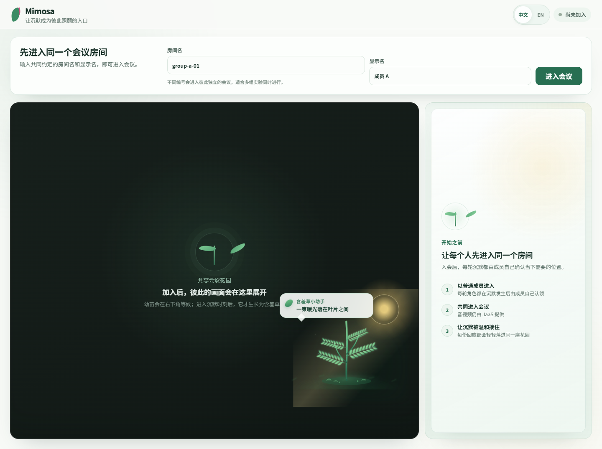

# Mimosa

[English](README.md) | [简体中文](README.zh-CN.md)

Mimosa 是一款面向在线会议的双语浏览器协作工具。它用轻松、温和的方式承接无人回应的问题，同时避免识别、评价或公开点名某位参与者。

应用内嵌 Jitsi/JaaS 会议，并在会议之上加入一片共享的生态场景。参与者可以私下表达“需要一点时间”“正在确认”或“有些社交压力”；系统再把这些选择转译为匿名的阳光、浇水和云层。正在等待回应的人可以据此放慢节奏、邀请大家补充、换一种方式提问，或把问题留到稍后。

**在线体验：** [mimosa-srtp.com](https://mimosa-srtp.com)  
**开源许可：** [MIT](LICENSE)



## 主要功能

- 基于 Jitsi as a Service（JaaS）的完整网页会议体验。
- 中文、英文两套界面，可在入会前或会议中切换。
- 支持手动标记开放问题，以及可选的本地沉默感知。
- 自动沉默弹窗出现时，以及有人认领等待角色或手动标记开放问题时，会播放 Jitsi silence reaction 使用的虫鸣提示音，提醒暂时没有注视会议窗口的成员。
- 用低成本的私密回应生成匿名的共享环境反馈。
- 包含生长、叶片运动、阳光、浇水、云层、种子暂存和恢复等自然动效。
- 暂存问题可以编辑，并在合适的时候重新带回讨论。
- 含羞草浮层可以拖动，浏览器会记住摆放位置。
- 参会人数动态变化，不限制为四人。
- 无需注册账户；本仓库也不会在服务端转写会议语音。

## 一轮 Mimosa 互动如何进行

1. 任意成员可以把一句话标记为开放问题。也可以在有人发言之后，由本地语音活动感知发现一段持续沉默。
2. 每位成员私下选择此刻最符合自己的位置：正在等待回应、可能会回应，或本轮暂时不需要 Mimosa。
3. 有成员认领“正在等待回应”后，幼苗会长成含羞草，叶片随即开始缓慢合拢。
4. 其他成员可以私下选择“需要一点时间”“正在确认”或“有些社交压力”。
5. 系统不会公开选择者身份。共享场景用协调后的环境变化表达房间中的回应，等待者只看到匿名统计。
6. 等待者可以作出关怀性回应：多留一点时间、邀请大家补充、换一种方式提问、稍后再回到，或确认已有成员回应。
7. 暂时搁置的问题会成为一颗种子，之后可以编辑并重新带回讨论。

这里的生态场景提供的是行动线索，而不是对人的诊断。Mimosa 不会声称自己知道某个人为什么沉默。

## 简单提醒版（Baseline）

同一套部署中也包含一个有意保持简洁的对照条件。在网址中加入 `condition=baseline` 即可进入。

1. 房间中至少先发生一次发言。
2. 此后讨论持续安静 8 秒，所有参与者会听到与 Mimosa 条件相同的虫鸣提示音。
3. 页面显示一条持续 5 秒、不可点击的中性提醒：“讨论暂时安静下来了。可以继续思考，也可以一起决定接下来怎么推进。”
4. 如果有人重新开口，提醒会提前渐隐。
5. 同一段连续沉默只触发一次；出现新的发言后，系统才会重新等待下一段 8 秒沉默。

简单提醒版不包含含羞草、角色选择、私密回应、环境反馈、关怀动作或种子暂存。两种条件使用相同的会议、8 秒阈值、提示音、语言选项、房间成员机制和匿名事件日志。

## 直接使用在线版本

打开 [https://mimosa-srtp.com](https://mimosa-srtp.com)，输入房间名和显示名后加入会议。使用同一个房间名的人会进入同一场会议；不同房间名对应彼此独立的会议。

也可以提前准备好链接：

```text
Mimosa 中文：https://mimosa-srtp.com/?condition=mimosa&room=community-weekly&name=Alex
Mimosa 英文：https://mimosa-srtp.com/?condition=mimosa&room=community-weekly&name=Alex&lang=en
简单提醒版中文：https://mimosa-srtp.com/?condition=baseline&room=community-weekly&name=Alex
简单提醒版英文：https://mimosa-srtp.com/?condition=baseline&room=community-weekly&name=Alex&lang=en
```

同时开展多场会议时，请为每组分配不同的房间名。建议只使用简单的字母、数字和连字符，例如 `team-a-2026-07-31`。

## 在本地运行

### 环境要求

- 当前维护中的 Node.js LTS 版本（推荐 Node.js 22）。
- Node.js 自带的 npm。
- 支持摄像头和麦克风权限的新版 Chromium、Firefox 或 Safari 浏览器。

### 安装步骤

```bash
git clone https://github.com/123Cx330Yrx/Mimosa.git
cd Mimosa
npm install
cp .env.example .env.local
npm run dev
```

Windows PowerShell 请将 `cp` 命令换成：

```powershell
Copy-Item .env.example .env.local
```

随后打开 Vite 在终端中给出的本地地址，通常是 `http://localhost:5173`。

## 配置 Jitsi as a Service

Mimosa 使用 JaaS 提供内嵌的音视频会议。公开部署时，请在 8x8 开发者控制台创建自己的 JaaS 应用，并把 App ID 写入 `.env.local`：

```dotenv
VITE_JAAS_APP_ID=vpaas-magic-cookie-your-app-id
VITE_RESPONSE_COUNT_MODE=exact
```

`VITE_JAAS_APP_ID` 是公开的项目标识，构建后出现在浏览器 JavaScript 中是正常的；它不是私钥。

不要把 JaaS 私钥、API Secret 或长期 JWT 写入 `.env.local` 或任何 `VITE_*` 变量。Vite 会把这些值暴露给浏览器。如果你的部署需要认证用户、录制或其他受保护的 JaaS 功能，应另建服务端令牌接口，并由服务端签发短期 JWT。

### 配置项

| 变量 | 可选值 | 作用 |
| --- | --- | --- |
| `VITE_JAAS_APP_ID` | JaaS App ID | 指定内嵌会议使用的 JaaS 应用。 |
| `VITE_RESPONSE_COUNT_MODE` | `exact`、`coarse`、`hidden` | 控制等待者看到的匿名回应数量精度。 |

修改环境变量后，需要重新启动开发服务器。

## 日常使用说明

### 创建或加入会议

让所有参与者在各自设备上填写完全相同的房间名。Mimosa 本身不限制只能四人使用；实际可容纳人数还会受到 JaaS 套餐、设备性能和网络环境影响。

### 切换语言

使用界面中的语言按钮，或在链接中加入 `lang=en`。未指定该参数时，Mimosa 默认显示中文。

### 切换实验条件

`condition=mimosa` 表示完整 Mimosa 互动版，`condition=baseline` 表示简单提醒版。网址不写 `condition` 时，默认进入 Mimosa。

两种条件使用彼此独立的顶层应用。`App.tsx` 只负责选择 `MimosaApp` 或 `BaselineApp`，Baseline 的计时器和提醒状态不会挂载到 Mimosa 路由。维护者可运行 `npm run verify:mimosa`，把 Mimosa 路由及其依赖与经过审计的多人稳定版本进行比较。

自动检测到沉默后，所有成员先收到私密的三选一角色提示。一名成员认领“正在等待回应”后，其他尚未选择的成员会进入新的二选一界面：“我可能会回应 / 暂时不需要”。只有选择“我可能会回应”后才进入匿名环境回应；认领完成后不再允许其他成员选择等待者角色。

同一个 baseline 房间的参与者链接与非参与式观察端链接示例：

```text
参与者：https://mimosa-srtp.com/?condition=baseline&room=group-a&name=Participant-A
观察端：https://mimosa-srtp.com/?condition=baseline&room=group-a&name=Researcher&research=1
```

同一场会议中的所有成员和观察员必须使用相同的 `condition` 与 `room`。系统会把不同条件映射到不同的底层 Jitsi 房间，因此 baseline 的 `group-a` 不会与 Mimosa 的 `group-a` 混入彼此的音视频或研究消息。观察端不会参与沉默感知和互动，但可以标记实验阶段，并集中收集带有条件标签的事件日志。

### 移动含羞草

拖动对话气泡即可移动整块含羞草浮层。位置会保存在当前浏览器中；双击拖动区域可以恢复默认位置。

### 同时开展多场会议

为每场会议设置不同的 `room` 参数：

```text
https://mimosa-srtp.com/?room=book-club-a
https://mimosa-srtp.com/?room=book-club-b
https://mimosa-srtp.com/?room=design-team
```

即使使用同一个网站部署，不同房间之间也彼此隔离。

## 构建与部署

生成生产版本：

```bash
npm run test
npm run lint
npm run build
```

可部署的静态网站会生成在 `dist/`。部署前可在本地预览：

```bash
npm run preview
```

大多数静态托管平台只需填写以下设置：

| 设置 | 值 |
| --- | --- |
| 构建命令 | `npm run build` |
| 输出目录 | `dist` |
| 环境变量 | `VITE_JAAS_APP_ID` |

项目可以部署到腾讯云 EdgeOne Pages、Cloudflare Pages、Netlify、Vercel 或其他静态网站托管平台。在 localhost 以外使用摄像头和麦克风时，网站必须启用 HTTPS。

### 腾讯云扁平 ZIP 包

部分腾讯云上传流程要求 `index.html` 和所有资源都位于 ZIP 根目录。完成构建后运行：

```bash
python scripts/package_tencent_flat.py
```

在其他电脑上使用前，请先把脚本中的 `OUTPUT` 常量改为本机有效路径。脚本会将资源引用改为扁平路径，并检查腾讯云不接受的非法文件名。

### GitHub Pages

当前 Vite 配置默认网站部署在域名根目录。如果发布到 `https://username.github.io/Mimosa/`，请在构建前把 Vite 的 `base` 设置为 `/Mimosa/`。使用独立域名且部署在根目录时无需修改。

## 实验日志

参与者浏览器保存带 ISO 时间戳、匿名编号和 `momentId` 的结构化事件。日志记录提示是否显示、选择或忽略，角色认领、匿名回应、关怀动作、问题延期、编辑后重新带回、移除、参与人数变化以及导出时的最终状态。日志不保存问题正文、音频、转写或真实姓名。

观察端请求日志后，系统通过会议数据通道收集每位参与者的最新事件。聚合文件包含 `condition`、房间名、日志结构版本、协议版本、实验设置，以及 `expectedParticipants`、`receivedParticipants` 和 `complete` 完整性标记。分析前应先确认 `complete` 为 `true`，再按匿名编号和 `momentId` 配对、去重事件。

## 隐私设计

- 语音活动仅在参与者自己的浏览器中处理。感知模块只区分“有人发言”和“安静”，不会录音、转写、上传或理解发言内容。
- Mimosa 的互动消息通过 Jitsi endpoint data message 交换。
- 共享场景只表达回应类别，并根据配置显示匿名统计，不公开成员身份。
- 界面位置和暂存内容可能保存在当前浏览器，以便刷新后恢复。
- 本仓库不包含用户账户、集中式分析服务或生产级认证后端。

在公开场合或组织内部使用前，请根据实际部署检查 JaaS 配置，并准备合适的隐私说明。

## 项目结构

```text
src/
├── App.tsx                            只负责选择实验条件
├── MimosaApp.tsx                     完整 Mimosa 会议流程
├── BaselineApp.tsx                   简单提醒条件
├── components/MimosaScene.tsx        生态场景与动效
├── domain/mimosaMachine.ts           互动状态转换
├── domain/protocol.ts                客户端之间交换的类型化消息
├── meeting/JaaSTransport.ts          Jitsi/JaaS iframe 与数据适配层
├── sensing/                           本地语音活动感知
├── i18n.ts                            中英文界面文案
└── App.css                            布局、视觉系统与动画
scripts/
├── package_tencent_flat.py           可选的腾讯云扁平打包工具
└── verify-mimosa-baseline.mjs        原版 Mimosa 回归守卫
docs/                                  设计与维护说明
```

## 自定义 Mimosa

- 在 `src/i18n.ts` 中修改中英文文案。
- 在 `src/components/MimosaScene.tsx` 中调整场景和 SVG 元素。
- 在 `src/App.css` 中修改布局、透明度、动效和响应式表现。
- 在 `src/domain/mimosaMachine.ts` 中修改互动状态与转换逻辑。
- 调整通信消息时，请同步修改 `src/domain/protocol.ts` 和对应测试。

扩展功能时，应继续保持“个人私密选择”和“房间公开状态”的边界。

## 质量检查

```bash
npm run test     # 运行单元测试和交互测试
npm run lint     # 检查代码质量
npm run build    # 类型检查并生成生产网站
```

提交 Pull Request 前，请确保三项命令均通过。

## 常见问题

### 会议区域一直是空白

检查 `VITE_JAAS_APP_ID` 是否有效，关闭可能拦截第三方脚本的扩展，并在浏览器控制台中确认 `8x8.vc` 脚本是否被阻止。同时确认网站允许加载第三方脚本。

### 参与者互相看不到

确认所有人使用完全相同的房间名和同一套 Mimosa 部署；检查摄像头、麦克风权限，以及当前网络是否阻止 WebRTC 通信。

### 两组人误入同一会议

两组复用了同一个房间名。为每个同时进行的会议分配唯一房间名即可。

### 沉默感知没有启动

浏览器需要获得麦克风权限，并且需要先有一次发言来建立对话已经开始的信号。之后成员是否闭麦不应改变逻辑：系统关注的是一次发言结束及其后的安静时段，而不是静音按钮本身。

### 含羞草挡住了会议按钮

拖动对话气泡即可移动整个浮层；之后可以双击拖动区域恢复默认位置。

## 参与贡献

欢迎提交 Issue 和 Pull Request。对于较大的交互改动，请先说明它解决的具体问题，以及如何继续维护隐私、低压力和角色不确定性。所有可见文案都应保持中英文同步；协议或状态机变化需要补充测试。

## 开源许可

Mimosa 使用 [MIT License](LICENSE) 开源。

项目内置的 Jitsi silence reaction 音频单独采用 Apache-2.0 许可，详见[第三方声明](THIRD_PARTY_NOTICES.md)。
